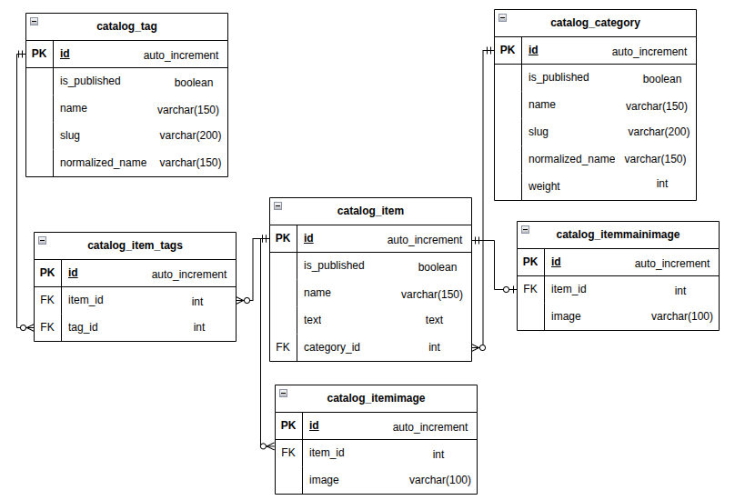

# Yandex Lyceum Django Project

## О проекте

Проект на Django для образовательной платформы "Яндекс Лицей".

## Как начать

### Предварительные требования

Перед запуском убедитесь что у вас установлены:

* **[Python 3.10+](https://www.python.org/downloads/)**
* **[Git](https://git-scm.com/install/)**
* **[Gettext](https://www.gnu.org/software/gettext/)**

### Инструкция по запуску

#### 1. Клонирование репозитория
```bash
git clone https://gitlab.crja72.ru/django/2026/spring/course/students/380833-meh.ww-course-1585.git
cd 380833-meh.ww-course-1585
```

#### 2. Создание виртуального окружения
**Для Windows:**
```bash
python -m venv venv
venv\Scripts\activate
```

**Для Linux/MacOS:**
```bash
python3 -m venv venv
source venv/bin/activate
```

#### 3. Установка зависимостей

Определитесь с необходимой зависимостью и установите ее:
* Prod (продакшн) – рабочая версия продукта, доступная обычным пользователям:
```bash
pip install -r requirements/prod.txt
```
* Test (тестирование) – инструменты и библиотеки для диагностирования проекта:
```bash
pip install -r requirements/test.txt
```
* Dev (режим разработчика) – инструменты и библиотеки, необходимые для написания, тестирования и сборки проекта.
```bash
pip install -r requirements/dev.txt
```

#### 4. Настройка переменных окружения

Есть два варианта для установки переменных окружения.
Вы можете задать их вручную или скопировать через готовый шаблон.

Ручная установка:
Важно! Выберите значения переменных самостоятельно.

**Для Windows (cmd):**
```bash
type nul > .env

echo DJANGO_ALLOWED_HOSTS=localhost,127.0.0.1 >> .env
echo DJANGO_DEBUG=False >> .env
echo DJANGO_SECRET_KEY=fake >> .env
echo DJANGO_ALLOW_REVERSE=false >> .env
```

**Для Linux/MacOs:**
```bash
touch .env

echo "DJANGO_ALLOWED_HOSTS=localhost,127.0.0.1" >> .env
echo "DJANGO_DEBUG=False" >> .env
echo "DJANGO_SECRET_KEY=fake" >> .env
echo "DJANGO_ALLOW_REVERSE=false" >> .env
```

Готовый шаблон:

**Для Windows (cmd):**
```bash
copy template.env .env
```

**Для Linux/MacOs:**
```bash
cp template.env .env
```

#### 5. Запуск сервера

Применение миграций:
```bash
cd lyceum
python manage.py migrate
```

Можно установить тестовые данные (фикстуры):
```bash
python manage.py loaddata fixtures/*.json
```

Создание суперпользователя, сбор статических данных и запуск сервера:
```bash
python manage.py createsuperuser
python manage.py collectstatic --noinput
python manage.py runserver
```

После успешного запуска сервер будет доступен по адресу http://127.0.0.1:8000

Панель администратора будет доступна по адресу http://127.0.0.1:8000/admin/

### Дополнительные настройки

Проект поддерживает русский и английский языки.

Для корректной работы перевода выполните следующие шаги:
```bash
django-admin makemessages -l ru --settings=lyceum.settings
django-admin makemessages -l en --settings=lyceum.settings
```

Отредактируйте .po файлы, добавив необходимый статический перевод!
```bash
django-admin compilemessages
```

## Структура проекта

ER-диаграмма базы данных проекта представлена в файле ER.jpg.


